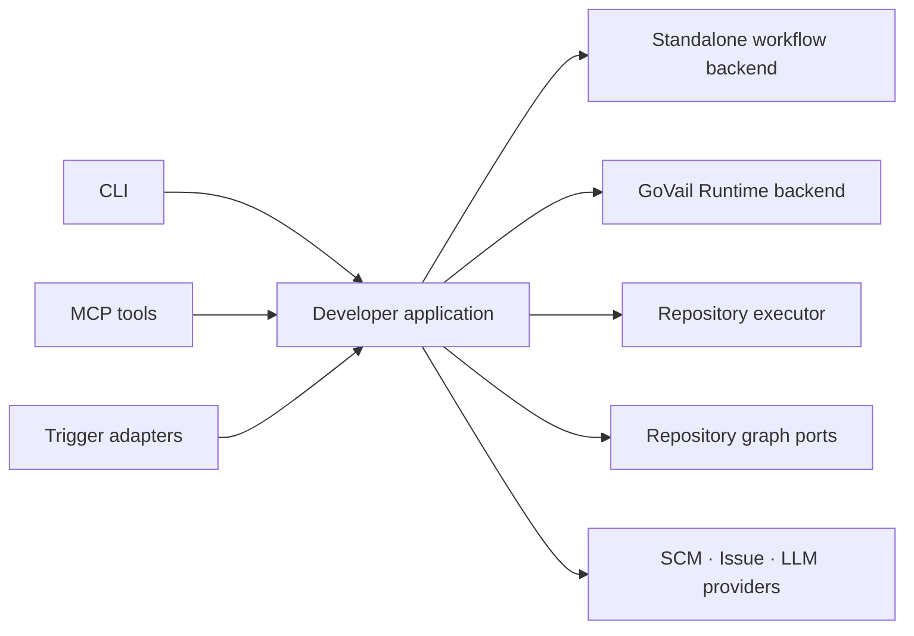

# GoVail MCP Architecture

## Product boundary

`govail-mcp` is the external product surface for configurable developer
automation. CLI, MCP, and event triggers are entry adapters over shared domain
and application contracts.

## Domains

- `developer/delivery`: commit, verification, approval, push, PR, and issue flows
- `developer/graph`: repository scanning and provider-neutral knowledge graph
- `developer/triggers`: normalized Slack, SCM, and issue-tracker events
- `providers`: replaceable LLM, SCM, issue, graph-store, and workflow backends

Standalone mode uses local providers and user-supplied LLM configuration. GoVail
mode delegates durable orchestration, reasoning, approval, and audit to GoVail
Runtime while preserving the same public workflow contract.

## Trust model

Models propose plans. Policies authorize typed capabilities. Executors perform
only approved operations and revalidate mutable external state immediately before
effects. Central services retain derived evidence and hashes rather than raw
repository source.

Developer Delivery V1 is specified in `docs/developer-delivery-v1.md`.
