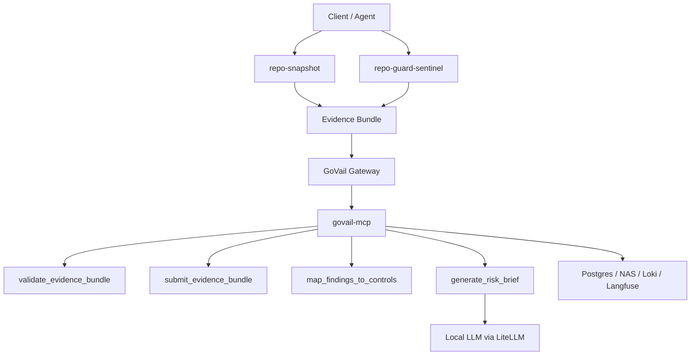

# GoVail GRC Evidence MCP 아키텍처

## 목적

GoVail GRC Evidence MCP는 로컬 개발 환경 또는 CI에서 생성한 보안 증거 묶음(evidence bundle)을 중앙 MCP 서버가 수신하고, 이를 거버넌스·리스크·컴플라이언스 관점으로 정규화하는 얇은 제어 계층이다.

이 서비스는 원본 소스코드 저장소가 아니다. 원본 코드 분석은 `repo-snapshot`, `repo-guard-sentinel` 같은 클라이언트 도구가 수행하고, 중앙 MCP는 최소한의 증거와 판정 결과만 받는다.

## 설계 원칙

- 원본 소스코드는 중앙 서버에 저장하지 않는다.
- 클라이언트 도구는 로컬 파일시스템에서 스캔을 수행하고, 마스킹된 evidence bundle만 제출한다.
- 중앙 MCP는 인증·감사 경계인 GoVail Gateway 뒤에서 동작한다.
- 모든 외부 서비스 주소는 환경 변수로 주입한다.
- 런타임은 맥미니 서비스 인프라에서 구동하고, M1 Max는 코드 편집 전용으로 유지한다.
- DB, Redis, Grafana, Loki, Langfuse 같은 공용 인프라는 `ai-service-infra`를 재사용한다.

## 논리 흐름



## 컴포넌트 역할

| 컴포넌트 | 위치 | 역할 |
| --- | --- | --- |
| `repo-snapshot` | 클라이언트 | 레포 구조, manifest, 아키텍처 근거 생성 |
| `repo-guard-sentinel` | 클라이언트 또는 CI | 시크릿, 내부망 노출, entropy, 정책 위반 finding 생성 |
| `govail-gateway` | 맥미니 | 인증, 정책 집행, 감사 경계 |
| `govail-mcp` | 맥미니 | evidence 수신, 검증, 통제 매핑, 리스크 브리프 생성 |
| LiteLLM / local LLM | 맥미니 경유 | 리스크 요약과 개선 가이드 생성 |
| `ai-service-infra` | 맥미니 | Postgres, Redis, Loki, Grafana, Langfuse 등 공용 런타임 |

## Evidence Bundle 최소 스키마

```json
{
  "bundle_id": "optional-client-id",
  "project_id": "govail",
  "source": "repo-guard-sentinel",
  "generated_at": "2026-07-12T00:00:00Z",
  "asset": {
    "type": "repository",
    "name": "example-service",
    "ref": "main"
  },
  "findings": [
    {
      "finding_id": "FIND-001",
      "title": "하드코딩된 시크릿 후보",
      "severity": "critical",
      "category": "secret",
      "evidence": {
        "file": "src/config.py",
        "line": 42,
        "masked_value": "sk-****"
      }
    }
  ]
}
```

## 중앙 MCP 도구

| 도구 | 설명 |
| --- | --- |
| `validate_evidence_bundle` | evidence bundle의 필수 필드와 원본 코드 포함 위험을 검사한다. |
| `submit_evidence_bundle` | 검증된 evidence bundle을 중앙 저장소에 기록한다. |
| `map_findings_to_controls` | finding을 NIST CSF, ISO 27001, CIS 관점의 통제 후보로 매핑한다. |
| `generate_risk_brief` | 로컬 LLM을 사용해 경영진/운영자용 리스크 요약을 생성한다. |

## 런타임 환경 변수

| 변수 | 설명 |
| --- | --- |
| `GOVAIL_GATEWAY_URL` | GoVail Gateway URL |
| `GOVAIL_RUNTIME_URL` | GoVail Runtime URL |
| `GOVAIL_MEMORY_URL` | GoVail Memory URL |
| `SENTINEL_API_URL` | Sentinel API URL |
| `LLM_API_URL` | OpenAI 호환 LLM API URL |
| `LLM_API_KEY` | LLM API 키 |
| `LLM_MODEL` | 리스크 브리프 생성 모델 |
| `LLM_MAX_TOKENS` | 리스크 브리프 최대 생성 토큰 수 |
| `LLM_ENABLE_THINKING` | Thinking 모델 추론 토큰 사용 여부. 기본값은 `false` |
| `GRC_DATABASE_URL` | 초기화 및 향후 영속 저장용 Postgres DSN |
| `GRC_EVIDENCE_HOST_DIR` | 맥미니 호스트의 evidence bundle 저장 경로 |
| `GRC_EVIDENCE_STORE_DIR` | 컨테이너 내부 evidence bundle 저장 경로 |
| `GOVAIL_HTTP_TIMEOUT` | 공통 HTTP 타임아웃 |

## 초기화

`init/001_grc_evidence_schema.sql`은 중앙 Postgres에 필요한 기본 테이블을 만든다. `scripts/init-grc-db.sh`는 `GRC_DATABASE_URL`을 받아 같은 스키마를 적용한다.

초기 MVP는 파일 저장소를 기본 기록 경로로 사용한다. Postgres는 감사 가능성과 검색 성능이 필요해지는 시점에 같은 스키마로 연결한다.
