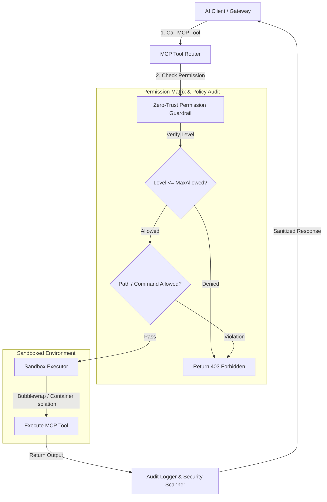

# Zero-Trust Tool Sandboxing & Permission Guardrail 아키텍처 (Phase 3)

## 📌 개요

GoVail MCP의 Phase 3 고도화는 AI 에이전트가 호출하는 MCP(Model Context Protocol) 도구의 가용 권한을 4단계 계층으로 분리하고, 격리된 샌드박스 환경 내에서만 파일 및 시스템 조작이 가능하도록 제한하는 **Zero-Trust Tool Sandboxing & Permission Guardrail** 엔진입니다.

---

## 🏗️ 시스템 아키텍처 및 데이터 흐름

---

## 🧩 핵심 구성 요소

### 1. Permission Matrix (`PermissionLevel`)
- `READ_ONLY` (Level 1): 로컬 파일 읽기, 정보 검색만 허용
- `CONTAINED_WRITE` (Level 2): 지정된 샌드박스 워크스페이스 내 파일 작성/수정만 허용
- `ISOLATED_EXEC` (Level 3): 샌드박스 격리 프로세스 내에서 허용된 세이프티 명령어만 실행
- `SYSTEM_ADMIN` (Level 4): 어드민 권한 조작 (기본 차단)

### 2. Sandbox Guardrail (`SandboxGuardrail`)
- **`validate_tool_call(tool_name, level, target_path, command)`**:
  - 요청 레벨이 허용 한도를 초과하거나 허용되지 않은 상위 경로(`../`) 접근 시 차단
  - 위험 커맨드(예: `rm -rf /`, `chmod 777`, `curl | bash`) 차단 룰셋 적용
- **`sanitize_output(output)`**:
  - 실행 결과 내 API Key, Secret Token 패턴 감지 및 자동 마스킹 처리

---

## 🧪 검증 계획
- **권한 수준 초과 차단 단위 테스트**: `READ_ONLY` 권한으로 `write_to_file` 호출 시 실패 검증
- **디렉토리 이스케이프 차단 테스트**: `../../` 경로 접근 차단 검증
- **위험 명령 차단 테스트**: 샌드박싱 밖 커맨드 차단 검증
- **Cargo Test 통합 실행**: 기존 및 신규 테스트 100% 통과 확인
