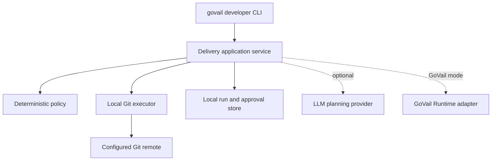

# Developer Delivery V1 Architecture

## Scope

The first vertical slice automates a local commit and an explicitly approved
push. It is available through a CLI first. MCP tools will call the same
application service in a subsequent slice.

## Trust boundary

The LLM may propose file groups, commit messages, verification commands, and
follow-up actions. It cannot mint approvals or directly execute Git commands.
The executor accepts typed operations rather than arbitrary shell strings.

The initial CLI keeps run state under the target repository's Git metadata so
that workflow state is not accidentally committed. Central MCP services receive
only derived metadata, hashes, and audit results—not source or full diffs.

## Push intent

After a local commit, the application creates a canonical push intent containing:

- repository identity and Git directory fingerprint
- remote name and normalized remote URL fingerprint
- exact source commit and parent commit
- target branch
- expected current remote commit, including explicit absence
- verification attestation identifier
- workflow schema version
- `force: false`

The canonical representation is hashed. Approval records bind an approver,
expiry, single-use state, and the exact intent hash. Immediately before push the
executor reloads the intent and approval, fetches the remote branch state, and
revalidates every bound field. Any mismatch invalidates execution.

The standalone CLI derives the local approver identity from the operating-system
account. This is local audit metadata, not an organization identity assertion.
GoVail mode must replace it with an authenticated Runtime/IdP subject.

## V1 policy

- Local commit may be automatic after verification.
- Staging requires an explicit repository-relative file allowlist.
- Push requires a separate human approval.
- `main`, `master`, and `release/*` are protected by default.
- Force push, ref deletion, URL changes, and approval reuse are forbidden.
- A changed local HEAD or remote head requires a new proposal and approval.

## Future adapters

The application contract will later support `StandaloneWorkflowBackend` and
`GoVailRuntimeBackend`. GitHub PR, Jira, graph stores, and trigger sources remain
provider adapters behind the developer domain rather than becoming CLI- or
MCP-specific logic.
